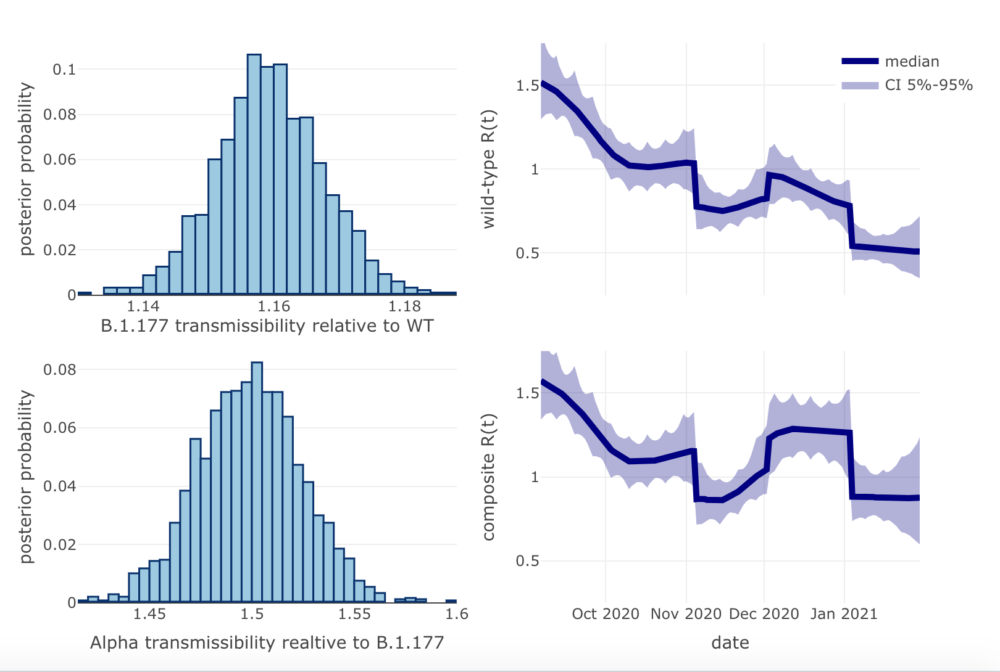
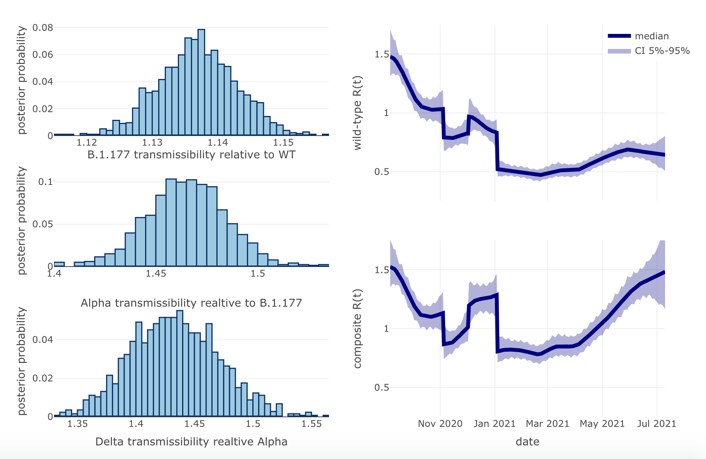

# VariantREstimate
This is a R package to estimate R(t) and the relative transmissibility of multiple variants of a virus from case numbers. The model is a SIS model with: a gamma distirubtion for the infectiousness; R(t) following a jump-diffusion process; and variants having ta constant relative transmissibility [[1]](#1). The models fit is fit to time-series of cases for each variant, with the posteriror disitribution of the parameters being sampled with Stan.

## Pacakge Functions
The pacakge contains a single function ```model.strain_multiplier()``` which returns a Stan model object. Standard RStan functions can then be used to sample parameters and input data and priors (e.g. ```rstan::sampling()```, see ```examples\england_summer_alpha.R```).

Input data is provided to the Stan model as a list containing the fields (see ```examples\england_summer_alpha.R``):

* ```n_dates``` - the number of dates on which cases data is provided
* ```n_strains``` - the number of variants modelled
* ```data_freq``` - the frequency of the data (e.g. 7L for weekly)
* ```cases``` - matrix of cases counts ( ```n_dates``` rows and ```n_strains``` columns)    
* ```n_jumps``` - number of jumps in the R(t) process
* ```jump_times``` - times at which jumps are allowed to take place (in days)
* ```seed_start_time``` - start of seeding periods (integer array of length  ```n_strains```)
* ```seed_end_time``` - end of seeding periods (integer array of length  ```n_strains```)  
* ```generation_mean``` - mean generation time of the infection
* ```generation_sd``` - standard deviation of generation time of the infection
* ```generation_max``` - maximum length of infections period
* ```test_mean``` - mean time after infection somebody is tested
* ```test_sd``` - standard deviation of time after infection somebody is tested
* ```ascertainment_factor``` - case ascertainment factor
* ```prior_R0_min``` - prior minimum R(0)
* ```prior_R0_max``` - prior maximum R(0)
* ```prior_dR_sd_min``` - prior minimum (absolute) daily change in R(t)
* ```prior_dR_sd_max``` - prior maximum (absolute) daily change in R(t)
* ```prior_phi_od_max``` - prior maximum over-dispersion of negative-binmial in observation model
* ```prior_jump_up_max``` - prior maximum factor of increase in R(t) at a jump
* ```prior_jump_up_min``` - prior minimum factor of decrease in R(t) at a jump
* ```prior_daily_seed_max``` - prior on maximum number of daily seeds during the seeding window (array of length ```n_strains```)
* ```prior_strain_multipliers_min``` - prior minimum of strain multiplier (array of length ```n_strains-1```)
* ```prior_strain_multipliers_max``` - prior maximum of strain multiplier (array of length ```n_strains-1```)
* ```multiply_strain_multipliers``` - strain multipliers are relative to the previous strain or the first strain
* ```mask_cases_less_than``` - mask cases in fit if less than this threshold

The sampled parameters are (see ```examples\england_summer_alpha.R``):

* ```strain_multipliers``` - the relative transmissibility of the strains to the wild-type strains (output is relative to wild-type regardless of ```multiply_strain_multipliers``` - which controls the underlying parameter which is sampled and improves samplin)
* ```R``` - array containing the daily estimated value of R(t) for the wild-type
* ```R_comb``` - array containing the daily estimate of R(t) weighted by the number of infections across variants
* ```jumps``` - array of estimated size of jumps (length ```n_jumps```)
* ```daily_seed``` - array of estimated daily seeds(length ```n_strains```)

## Examples
The first example of a model fit is contained in ```examples\england_summer_alpha.R```, which takes data for SARS-Cov2 infections in England from the UK Dashboard and COG-UK between September 2020 and January 2021.
The model contains 3 variants of the virus  (wild-type, B.1.177, Alpha) and estimates the relative transmissibility of the variant to one another.
The output of the example script is this plot containing the posterior distirubtions for the relative transmissibility of the variants and R(t) for both the wild-type variant the compositer R(t) across all variants.

<p></p>

The second example of a model fit is contained in ```examples\england_summer_alpha_delta.R```, which takes data for SARS-Cov2 infections in England from the UK Dashboard and COG-UK between September 2020 and July 2021.
The model contains 4 variants of the virus  (wild-type, B.1.177, Alpha, Delta) and estimates the relative transmissibility of the variant to one another.
The output of the example script is this plot containing the posterior distirubtions for the relative transmissibility of the variants and R(t) for both the wild-type variant the compositer R(t) across all variants.

<p></p>


## References
<a id="1">[1]</a> 
Hinch R., Panovska-Griffiths J., Probert W., Ferretti L., Wymant C., Di Lauro F., Baya N., Ghafari M., Abeler-Dörner, COG-UK, Fraser C. (2021), Estimating SARS-CoV-2 Variant Fitness and the Impact of Interventions in England using Statistical and Geo-Spatial Agent-Based Models. Phil. Trans Roy Soc A (under review)

